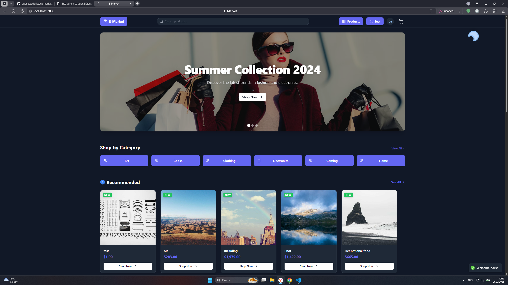
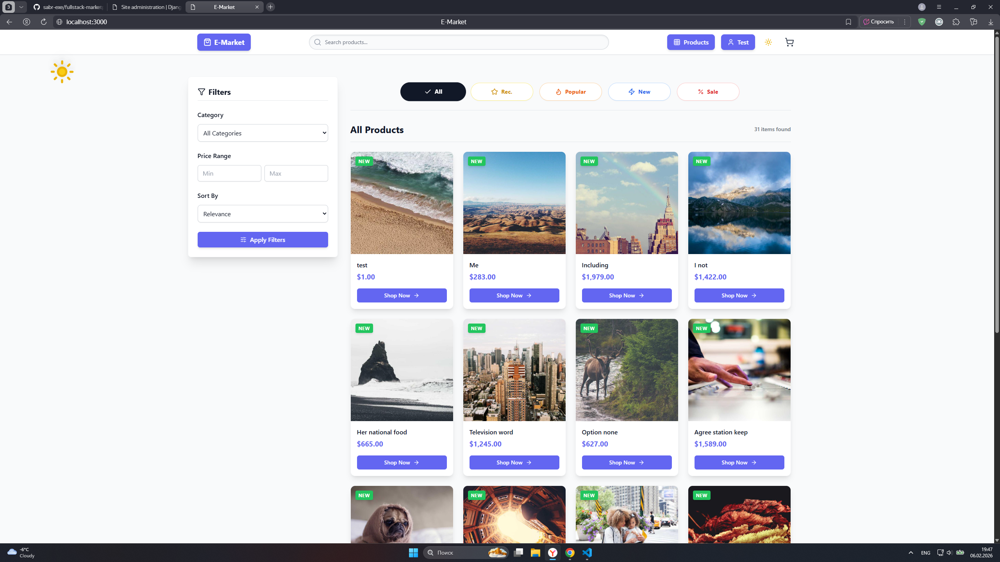
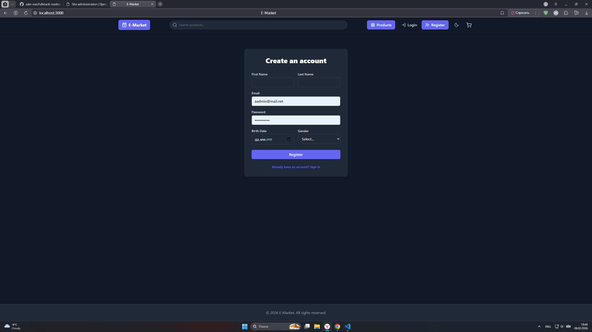

# 🛒 Fullstack Marketplace

A modern fullstack marketplace web application built with Django REST Framework and React (Vite).

---

## 🚀 Tech Stack

### Backend
- Django
- Django REST Framework
- JWT Authentication
- PostgreSQL / SQLite

### Frontend
- React
- Vite
- Axios
- Tailwind CSS (optional)

### Tools
- Git & GitHub
- REST API

---

## ✨ Features

✅ User registration & authentication (JWT)  
✅ Product catalog  
✅ Categories & filtering  
✅ Shopping cart  
✅ Orders system  
✅ Admin panel  
✅ REST API  
✅ Responsive UI  

---

## 📁 Project Structure

fullstack-marketplace/
├── backend/
│   ├── api/
│   ├── core/
│   ├── manage.py
│   └── requirements.txt
├── frontend/
│   ├── src/
│   ├── public/
│   └── package.json
└── README.md

---

## ⚙️ Installation & Setup

### 1️⃣ Clone repository

```bash
git clone https://github.com/sabr-exe/fullstack-marketplace.git
cd fullstack-marketplace
2️⃣ Backend setup
cd backend

python -m venv venv
source venv/bin/activate   # Windows: venv\Scripts\activate

pip install -r requirements.txt

cp .env.example .env

python manage.py migrate
python manage.py createsuperuser
python manage.py runserver
Backend runs on:

http://127.0.0.1:8000
3️⃣ Frontend setup
cd frontend

npm install

cp .env.example .env

npm run dev
Frontend runs on:

http://localhost:5173
🔐 Environment Variables
Backend .env
SECRET_KEY=
DEBUG=
DATABASE_URL=
JWT_SECRET=
Frontend .env
VITE_API_URL=http://localhost:8000/api
## 📸 Screenshots

### Home Page


### Products


### Order


### Login


### Admin Panel


🌍 API Documentation
Base URL:

/api/
Example endpoints:

POST   /api/auth/login/
GET    /api/products/
POST   /api/orders/
📌 Roadmap
 Payment integration

 Wishlist

 Reviews system

 Deployment

 Mobile optimization

👨‍💻 Author
Hoshgeldi Amanyazow

GitHub: https://github.com/sabr-exe

📄 License
This project is licensed under the MIT License.

